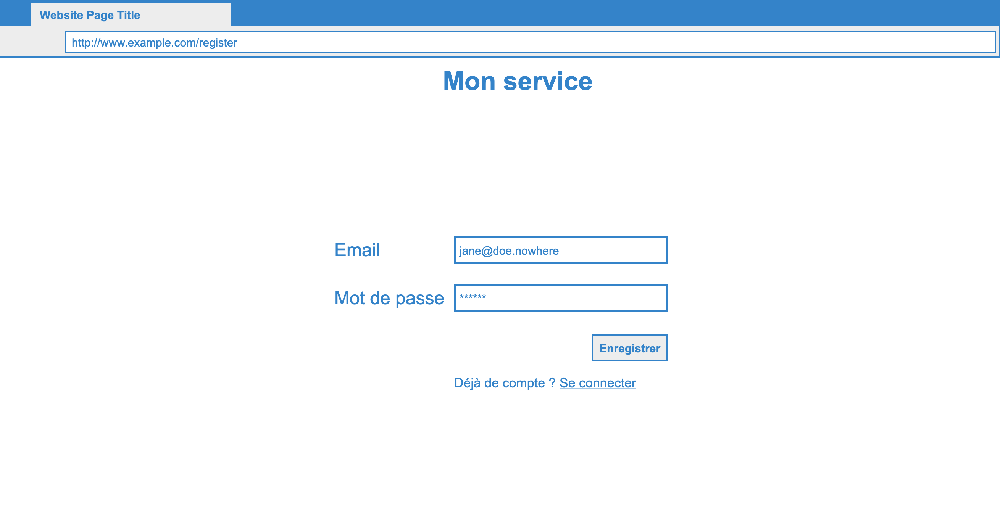

# My profile frontend 

We will use [React](https://fr.reactjs.org/) and [Redux](https://redux.js.org/)

This project is already setup as an universal app with [razzle](https://razzlejs.org/) with some modifications. Razzle ease the configuration of Javascript project tooling : babel, webpack, jest and hot module remplacement.

Below is a list of commands you will probably find useful:
- `npm install`

Install project dependencies.

- `npm run dev`

Runs the project in development mode.  
You can view your application at `http://localhost:8080`

The page will reload if you make edits.

- `npm run build` 

Builds the app for production to the build folder.

The build is minified and the filenames include the hashes.
Your app is ready to be deployed!

- `npm start` 

Runs the compiled app in production.

You can again view your application at `http://localhost:8080`

 - `npm test` 

Runs the test watcher (Jest) in an interactive mode.
By default, runs tests related to files changed since the last commit.

## Objectif

We want to create 3 pages :
- Signup page:

- Signin page:

- Profile page:

Business Rules:

1. The authentication and identity backend is the auth service from the previous training

2. When you encouter an error, you must display a "toast" dialog to inform the user

> Errors should be as sound as possible, but understandable for a user.

3. The authentication and identity backend is the auth service from the previous training

4. The authentication and identity backend is the auth service from the previous training

## Docs

You probably should read thoses docs before you start:
- [some javascript](./doc/javascript.md)
- [architecture of the project](./doc/architecture.md)
- [introduction to redux](./doc/redux.md)