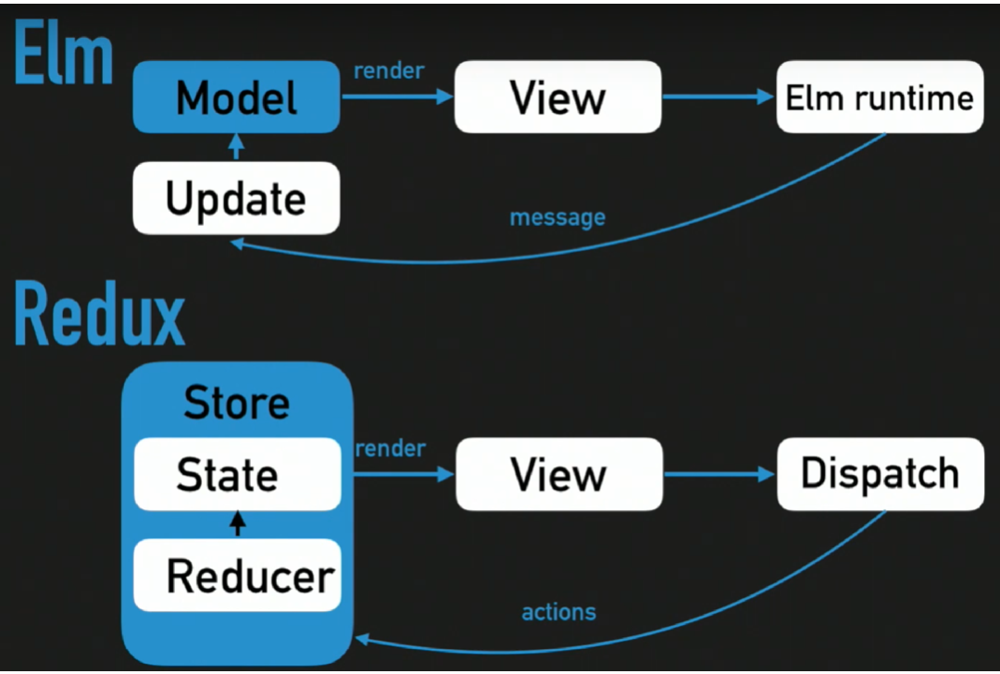

# Redux

Like react, redux have a long story with many way to use it. This training is not THE ONLY WAY to do redux, it presents a way to use an idiomatic ELM Architecture pattern with the middleware redux-loop.

## Store

A **store** is a container that holds your application's global state.

A store is a JavaScript object with a few special functions and abilities that make it different than a plain global object:
- You must never directly modify or change the state that is kept inside the Redux store
- Instead, the only way to cause an update to the state is to create a plain action object that describes "something that happened in the application", and then **dispatch the action** to the store to tell it what happened.
- When an action is dispatched, the store runs the root **reducer function**, and lets it calculate the new state based on the old state and the action
- Finally, the store notifies subscribers that the state has been updated so **the UI can be updated with the new data**.

### Similarity with Elm

## Redux Loop

While usual reducer function just return the state, [redux-loop](https://redux-loop.js.org/docs/api-docs/loop.html) reducer function may return `loop : (state, cmd) -> [any, Cmd]`

- state: any – the new store state, like you would normally return from a reducer.
- cmd: [Cmd](https://redux-loop.js.org/docs/api-docs/cmds.html) – a cmd to run once the current action has been dispatched, can be a result of any of the functions available under Cmd.
- returns an Array pair of the state and the cmd, to allow for easy destructuring as well as a predictable structure for other functionality.

`loop` enables you to run cmds as the result of a particular action being dispatched. It links synchronous state transitions with expected async state transitions. When you return a loop result from your reducer, the store knows how to separate cmds from state so cmds are not stored in the state tree with data.

## Dispacthing an action from a component

To dispact an action inside a component, use the  function [dispatch](https://redux.js.org/api/store#dispatchaction) from the store 

You have an exemple in `src/pages/home/index.js`

## Accessing state informations from a component

To access informations from the current state inside a component, use the hook [useSelector](https://react-redux.js.org/api/hooks#useselector)

You have an exemple in `src/pages/home/index.js`

## Logging

Redux logger is setup in dev. Open your browser console to browse history of actions.